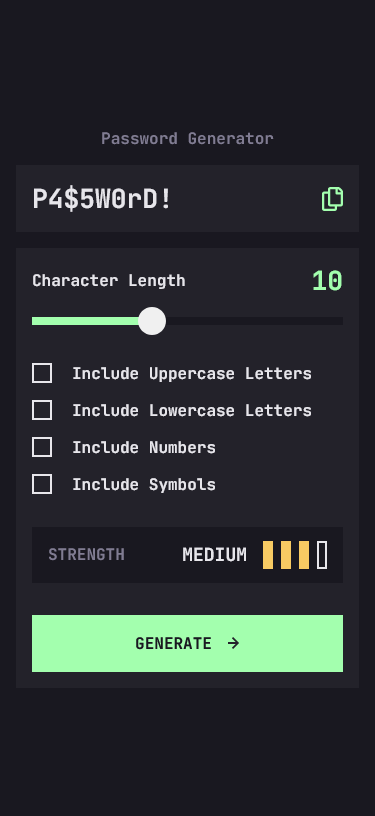
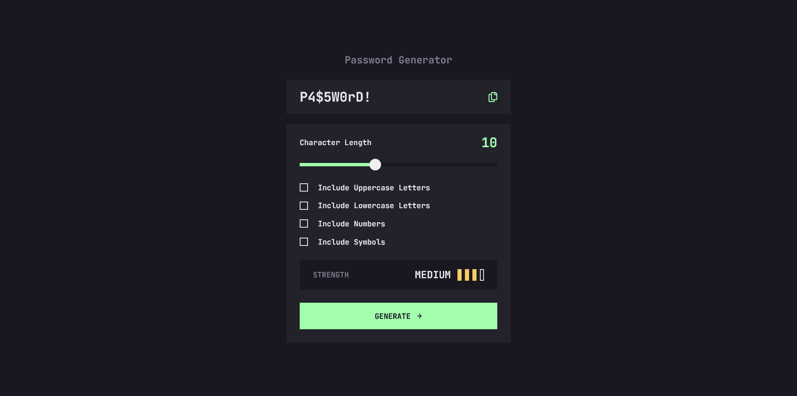

# Frontend Mentor - Password generator app solution

This is a solution to the [Password generator app challenge on Frontend Mentor](https://www.frontendmentor.io/challenges/password-generator-app-Mr8CLycqjh). Frontend Mentor challenges help you improve your coding skills by building realistic projects.

## Links

- Solution URL: [Frontend Mentor Solution Page](https://www.frontendmentor.io/solutions/password-generator-app-O-FdWw0s2C)
- Live Site URL: [GitHub Pages Site](https://karolbanat.github.io/fem-password-generator-app/)

## Built with

- Semantic HTML5 markup
- CSS custom properties
- Mobile-first workflow
- Vanilla JS/TS
- [Vite](https://vitejs.dev/)

## Useful resources

- [Custom Range Input](https://www.smashingmagazine.com/2021/12/create-custom-range-input-consistent-browsers/)
- [Typing animation](https://www.youtube.com/watch?v=w1nhwUGsG6M)
- [zxcvbn](https://www.npmjs.com/package/zxcvbn) - Checking password strength
- [Stackoverflow](https://stackoverflow.com/questions/18389224/how-to-style-html5-range-input-to-have-different-color-before-and-after-slider) - Range input progress fill for Firefox

## Author

- Frontend Mentor - [@karolbanat](https://www.frontendmentor.io/profile/karolbanat)

## Screenshots

